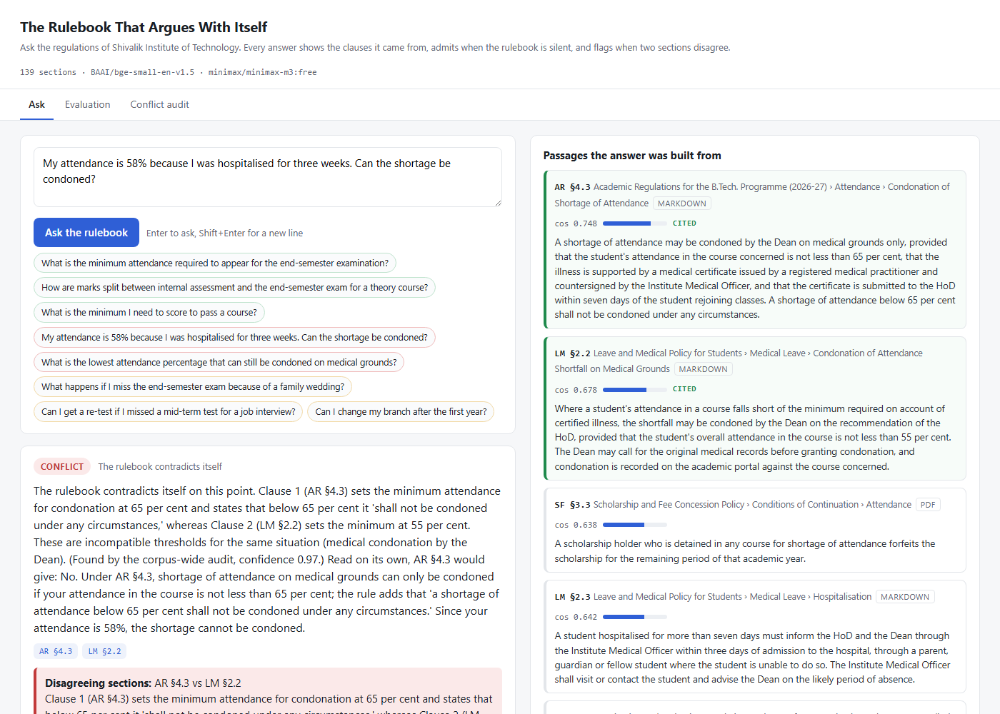

# The Rulebook That Argues With Itself

A question-answering service over a university rulebook that **cites the clause it quotes**,
**admits when the rulebook is silent**, and **tells you when two sections disagree**.

Built for the IT Geeks vibe coding round, Problem 1. FastAPI, one `POST /ask`, a plain HTML page
on top. Every passage the answer was built from is shown next to it, with section reference and
similarity score, not hidden behind a click. Everything runs on **free** OpenRouter models and a
local embedding model.

| | |
|---|---|
| **Live** | http://34.93.55.172/ (GCE, Mumbai) · https://guy-easily-veterans-victorian.trycloudflare.com (HTTPS tunnel) · http://34.93.55.172.nip.io/ |
| **Demo video** | _link goes here_ |
| **Try a link** | [answered](http://34.93.55.172/?q=What%20is%20the%20minimum%20attendance%20required%20to%20appear%20for%20the%20end-semester%20examination%3F) · [not covered](http://34.93.55.172/?q=What%20happens%20if%20I%20miss%20the%20end-semester%20exam%20because%20of%20a%20family%20wedding%3F) · [conflict](http://34.93.55.172/?q=My%20attendance%20is%2058%25%20because%20I%20was%20hospitalised%20for%20three%20weeks.%20Can%20the%20shortage%20be%20condoned%3F) · [audit](http://34.93.55.172/?tab=audit) · [evaluation](http://34.93.55.172/?tab=eval) |
| **Result** | 47/47 on the labelled test set, graded on the server, on Gemini Flash Lite from Google AI Studio's free tier; audit finds 3/3 planted contradictions plus one I had not planted |



## The three response types

| Status | When | What you see |
|---|---|---|
| `answered` | a passage explicitly addresses the situation | a direct answer, the cited section ids, the passages highlighted green |
| `not_covered` | the corpus is silent, **including when it covers a neighbouring situation** | a plain "the rulebook does not address this", plus the nearest clause (amber) and what it *does* cover |
| `conflict` | two sections give incompatible rules for the thing asked | both clauses quoted, no winner picked, and the clause naming **who can settle it** |

The hard row is the middle one. "What if I miss the exam for a family wedding?" retrieves the
medical-absence clause at 0.60 similarity. A confident chatbot answers from it. This one says the
rulebook only covers illness and deputation, and stops.

Two things the brief did not ask for:

- **Corpus-wide conflict audit** (`Conflict audit` tab, `scripts/audit.py`). Instead of waiting
  for somebody to ask the right question, every section is compared with every similar section
  in another document and a model judges each pair. It found the three planted contradictions,
  cleared the distractors, and found a fourth inconsistency I had written by accident
  (two different deadlines for the same medical certificate).
- **Live self-grading evaluation** (`Evaluation` tab). The 47-question test set runs in the
  browser and grades itself on response type *and* cited sections, with a confusion matrix.

## Results

Submitted configuration: Google AI Studio free tier, one project, `gemini-3.5-flash-lite` (with
`gemini-2.5-flash` and `gemini-flash-lite-latest` behind it); then Mistral's free plan
(`ministral-8b-2512`, `open-mistral-nemo`) as the first fallback for live questions; then
OpenRouter and Groq free models; embeddings `BAAI/bge-small-en-v1.5`. Details in
[`docs/EVALUATION.md`](docs/EVALUATION.md) and [`results/`](results/).

| Category | Passed | Total |
|---|---|---|
| answerable (status right **and** expected section cited) | 18 | 18 |
| conflict (status right **and** both sections named) | 4 | 4 |
| not covered | 25 | 25 |
| audit: planted contradictions found | 3 | 3 |
| audit: false positives among 50 pairs | 2 | |

A single question answers in about 1.8 s; the full set grades on the server in a few minutes
at the free tier's per-minute rate. Earlier in the project the same 47 questions scored 47/47 on
an OpenRouter free model that was withdrawn the next morning, 46/47 on Groq before its daily
token cap ran out, and 44 to 47 before the attribution check existed. One episode is recorded
rather than hidden: spreading the run across ten free Google projects made it finish in 18 s
and got eight of the projects suspended for quota circumvention within the hour. The client
still supports several keys per provider, for keys that are legitimately separate; the
submission runs on one project. The run-by-run table, the variance, and what fixed each thing
are in [`docs/EVALUATION.md`](docs/EVALUATION.md).

Three of my original not-covered questions turned out answerable on a strict reading (the
rulebook has a positive list, and "not on the list" is an answer). They were moved to an
ungraded borderline set with the reasoning, and replaced. [`tests/questions.json`](tests/questions.json)
records all of it.

## How it works

```
question ─► hybrid retrieval ─► similarity gate ─► LLM classifies + answers ─► validator ─► response
             bge-small dense       < 0.45: silent,     JSON only, passages      citations must
             + BM25, fused by      no LLM call         only, no outside          exist in the
             reciprocal rank                           knowledge                 retrieved set
```

1. **Chunking**: each numbered sub-section is one chunk with a stable id like `AR §4.3`.
   Markdown headings drive the parser; the PDF is read with pypdf. Fee tables stay intact.
2. **Retrieval**: dense cosine (local `bge-small`) fused with BM25 by reciprocal rank, because
   regulations are full of exact tokens embeddings blur ("65 per cent", "Rs. 800").
3. **Gate**: best passage under cosine 0.45 means silent, no LLM call. Measured: off-topic
   questions peak at 0.44, the weakest covered question scores 0.55.
4. **Classification**: one JSON call, temperature 0, with a prompt that spells out what is *not*
   a conflict (waivers, cross-references, agreeing clauses) and forbids reasoning by analogy.
5. **Validation**: citations are checked against the passages the model was shown. An
   `answered` with no valid citation is downgraded; a `conflict` naming fewer than two real
   sections is downgraded. The model cannot invent a source.
6. **Attribution check**: every `answered` gets a second, narrower call with only the cited
   passages: do they explicitly govern this situation, or a neighbouring one? "Absence for
   illness" stops answering "absence for a wedding" even when the first pass slipped.
7. **Audit-informed escalation**: if the answer uses a disputed value from a contradiction the
   corpus audit has already found, while the other side was also retrieved, the response is
   escalated to `conflict` with both clauses. Free models are not deterministic; this makes the
   conflict behaviour stable and is recorded in `validation_notes`.
8. **Authority**: on a conflict, the clause that decides inconsistencies (`AR §15.1`) is
   retrieved and shown as "who can settle this".

Full detail in [`docs/ARCHITECTURE.md`](docs/ARCHITECTURE.md).

## Corpus and test set

- [`corpus/`](corpus/): a rulebook for a fictional college, Shivalik Institute of Technology,
  Indore. Six documents, 139 sections, 7,200 words: four markdown pages, a fee schedule made of
  tables, one PDF generated from markdown so the ingester really parses a PDF.
- [`corpus/CONTRADICTIONS.md`](corpus/CONTRADICTIONS.md): the three planted contradictions,
  across formats, and the distractors that must not be flagged. The system never reads it.
- [`tests/questions.json`](tests/questions.json): 18 answerable, 4 conflict, 25 not-covered,
  3 borderline.

## Run it

```bash
git clone https://github.com/Sarthak195/rulebook-that-argues.git
cd rulebook-that-argues
python -m venv .venv
.venv\Scripts\activate            # Windows;  source .venv/bin/activate on macOS/Linux
pip install -r requirements.txt
copy .env.example .env            # put your OpenRouter key in .env (a free-tier key is enough)
uvicorn app.main:app --reload
```

Open http://127.0.0.1:8000. The first start downloads the embedding model (about 130 MB) and
builds the index in under a minute; later starts load it from `index/`.

```bash
python scripts/evaluate.py        # grade the test set        -> results/eval_report.md
python scripts/audit.py           # corpus-wide contradiction audit -> results/conflict_audit.md
python scripts/probe_models.py minimax/minimax-m3:free google/gemma-4-31b-it:free   # compare models
python -m pytest -q               # 6 unit tests, no key needed
docker build -t rulebook . && docker run --rm -p 8000:8000 --env-file .env rulebook
```

API reference in [`docs/API.md`](docs/API.md); the deployed VM and how it was built in
[`docs/DEPLOYMENT.md`](docs/DEPLOYMENT.md).

## What is mocked, and other honest notes

- **Nothing in the answer path is mocked.** Embeddings run locally; the LLM is a real call to a
  provider. The submitted configuration uses Google AI Studio's free tier (Gemini Flash Lite,
  one project), with OpenRouter and Groq free models as fallback; any OpenAI-compatible endpoint
  can be added to the chain.
- **Without a key** the API runs in an `offline-fallback` mode that returns the closest passage,
  labelled as such, so the UI stays usable. Every response carries a `mode` field.
- **The corpus is fictional.** Using a real university's text would have meant planting
  contradictions in someone else's regulations. Structure and language mirror Indian B.Tech.
  regulations.
- **Free models are slow, rate-limited, and impermanent.** Answers take 3 to 15 s. The client
  retries with backoff on 429 and fails over across a chain of free models; the default model
  used for the evaluation, `minimax/minimax-m3:free`, was withdrawn by OpenRouter the next
  morning, which is why the chain exists. The `openrouter/free` router is deliberately avoided:
  in testing it handed a question to a content-safety classifier that replied "User Safety: safe".
- **Free-tier quotas are small.** An OpenRouter key without credits gets 50 free-model requests
  per day (1,000 with $10 of credits on the account, still using only free models). The health
  endpoint and the page header show what is left. Free Groq and Google AI Studio keys are
  accepted as alternative providers in the same chain; see `.env.example`.
- **One paid run exists** (`results/eval_gemini-2.5-flash.md`, three cents, made before the
  free-only rule) and is kept as a reference. Nothing uses it.
- **Thresholds are tuned to this corpus and embedding model.** Swap either and re-measure.

## Why this shape

IT Geeks builds Shopify Plus stores. The failure this brief describes happens on every merchant
site: the returns page says 30 days, the FAQ says 14, and the support bot confidently picks one.
This service is corpus-agnostic. Point `CORPUS_DIR` at a folder of a store's shipping, returns
and warranty policies and you get a policy assistant that cites, abstains, and finds the
contradictions before a customer does.

## Layout

```
app/            chunking, retriever, llm client, pipeline, audit, FastAPI app
corpus/         the rulebook (md, tables, pdf) + CONTRADICTIONS.md answer key
scripts/        ingest, evaluate, audit, probe_models, build_pdf
static/         single-page front end
tests/          questions.json (labelled test set), test_pipeline.py (pytest)
results/        eval_report.md, conflict_audit.md and their JSON (generated, committed)
docs/           ARCHITECTURE, API, EVALUATION, DEPLOYMENT, VIDEO_SCRIPT, screenshots
deploy/         startup.sh for the GCE VM
```

Built with Claude Code as the pair programmer; the commit history is the working log.
